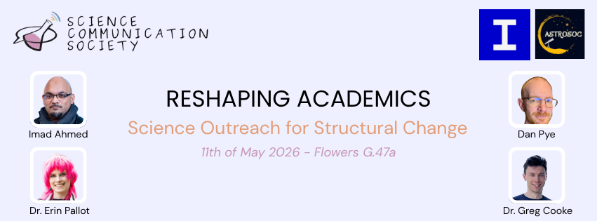

The newly formed Science Communication Society is excited to invite you to our first event: Science Outreach for Structural Change on 11th May 1700 - 1900. We are joined by four wonderful speakers, each with a unique perspective on science communication. The speakers will share their journey and challenges of setting up science outreach projects; maybe, they will inspire you to start your own. 

The free event is tailored to students from across all levels, undergraduates to PhDs, Postdocs and staff. There will be refreshments and networking opportunities after the event.

Location: Flowers G.47a room, Flowers Building, Imperial College London South Kensington Campus

RSVP through the following google form: https://forms.gle/US3ivLumkqaJLdBb6

## Programme
- 16:45 Doors open
- 17.05 Word of welcome
- 17:10 Dr. Erin Pallot, Manchester University, will discuss how public engagement and outreach sit within
academia, and how we can better embed them structurally.
- 17:25 Dr. Greg Cooke, University of Cambridge, will discuss how he balances his research with his outreach work, in his case improving female representation in UK science specifications.
- 17:55 Dan Pye, Kielder Observatory, will explore how meaningful public engagement is often driven not just by expertise, but the courage to build something new. He will share insights into creating impactful science communication from the ground up.
- 18.10 Imad Ahmed, University of Cambridge, will explore how problems faced by marginalised individuals and communities can be solved through building interdisciplinary science communication initiatives.
- 18:35 Reception and networking

## Speakers' Bios

- Dr Erin Pallot, University of Manchester, recently finished her PhD in Immunology and was a PPIE (Patient and Public Involvement and Engagement) Award Winner of 2025 for researching why most researchers rarely bring their research into public settings, and for starting a science communication platform to fix these issues.

- Dr Greg Cooke, University of Cambridge, is a theoretical astrophysicist researching hycean worlds. Furthermore, he researches how female scientists can be more represented into classroom teaching in ways that align naturally with existing lessons and fit within current course specifications.

- Dan Pye is the Director of Astronomy and Science Communication and Deputy CEO at Kielder Observatory, one of the UK’s leading public observatories. With an unconventional route into science engagement, Dan has built a career through connecting people with the universe beyond traditional academic pathways.

- Imad Ahmed, University of Cambridge, is the Director of New Crescent Society, the UK’s largest Muslim amateur astronomy network, dedicated to celebrating Islam’s rich astronomical heritage and reconnecting Muslim communities with the moon. He is also a PhD candidate in Theology and Religious Studies.